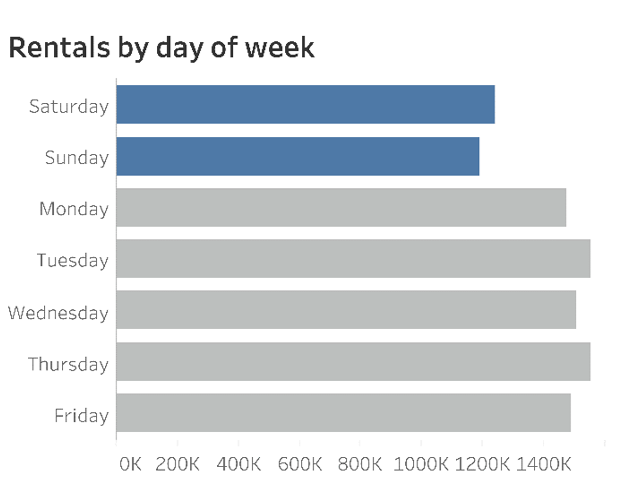
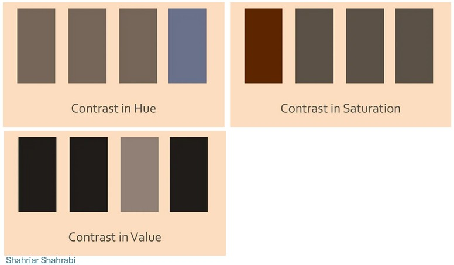
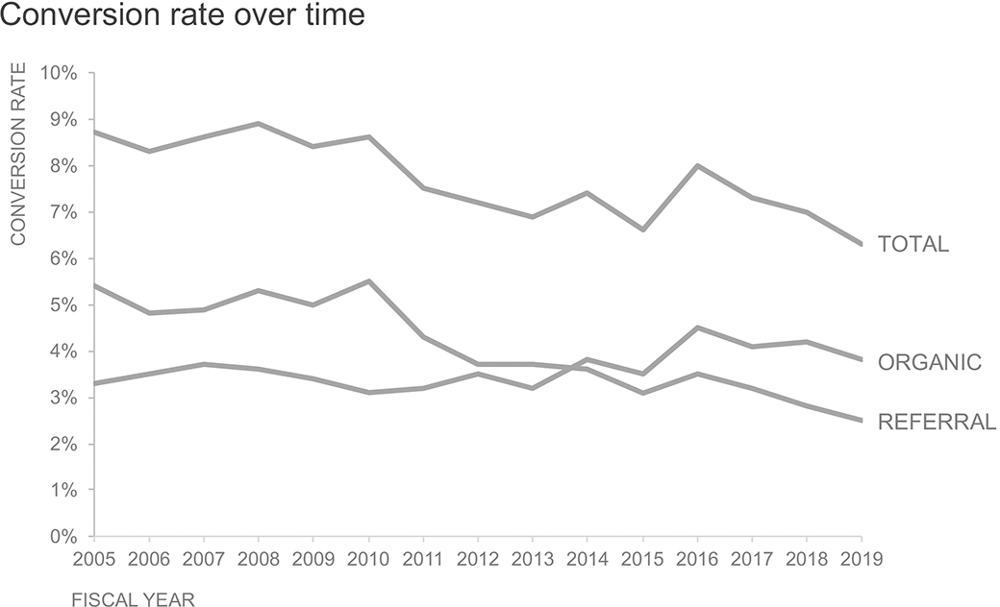
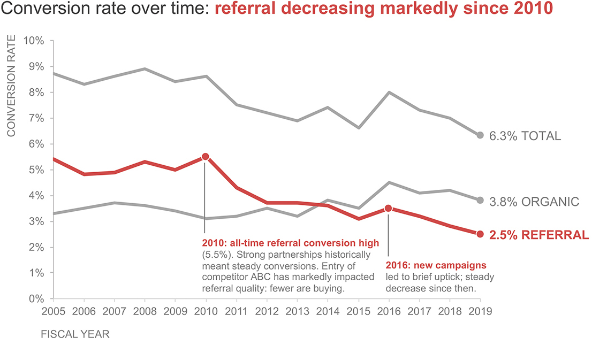
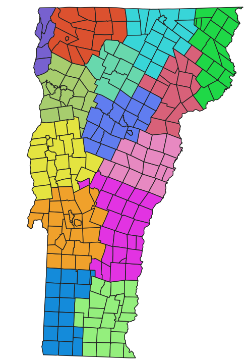
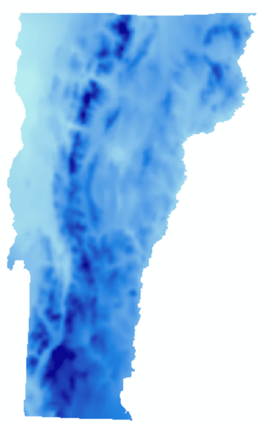

## Visualization critique

](InClassStatic/maddoxViz.png){fig-align="center"}

## Visualization critique

](InClassStatic/mahika.png){fig-align="center"}

## Visualization critique

" *Biological Conservation* 313 (2026): 111533.](InClassStatic/claudia_1.jpg){fig-align="center"}

## Visualization critique

 Comparative Biochemistry and Physiology Part A: Molecular & Integrative Physiology 299 (2025): 111771.](InClassStatic/claudia_2.jpg){fig-align="center"}

## Next week's critiques

-   Serena

-   Lilah

-   Elsa

## Coursekeeping

Coding exercise 2 is now available on Canvas, due next Thursday!

{alt="the-decoder.com"}

## Coursekeeping

Data science is fine, but when are we going to learn how to *hack?*

{fig-align="center"}

## Coursekeeping

Projects are five weeks out! Where should I be?

::: incremental
-   Get proposal feedback from Ben by tomorrow!

-   Start a Quarto document that keeps track of your ideas, sources, and datasets

-   Explore your datasets and find more, try building some visualizations!

-   Talk to Ben about what you're finding!
:::

## Dataset of the Day


::: {.cell}

:::


FEMA National Risk Index

{fig-align="center"}

## Effectively communicating with visuals

::: incremental
-   What's the headline?

-   Drawing the eye

-   Conveying the mood
:::

## What's the headline?

{alt="Krzywinski, Martin, and Alberto Cairo. 2013. \"Storytelling.\" Nature Methods 10 (8): 687--687. https://doi.org/10.1038/nmeth.2571." fig-align="center"}

## What's the headline?

{alt="Krzywinski, Martin, and Alberto Cairo. 2013. \"Storytelling.\" Nature Methods 10 (8): 687--687. https://doi.org/10.1038/nmeth.2571" fig-align="center"}

## What's the headline?

{alt="Krzywinski, Martin, and Alberto Cairo. 2013. \"Storytelling.\" Nature Methods 10 (8): 687--687. https://doi.org/10.1038/nmeth.2571" fig-align="center"}

## What's the headline?

{alt="Krzywinski, Martin, and Alberto Cairo. 2013. \"Storytelling.\" Nature Methods 10 (8): 687--687. https://doi.org/10.1038/nmeth.2571" fig-align="center"}

## What's the headline?

What is the headline for this graph?

{alt="statista.com" fig-align="center" width="80%"}

## Drawing the eye

It's easy for the headline to get lost in a data graph. It's OK to help the audience find it.

:::::: columns
::: {.column width="50%"}
{fig-align="center"}
:::

:::: {.column width="50%"}
{fig-align="center"}

::: {style="font-size: 50%;"}
<https://www.rashdesign.com/blog/2021/9/24/stevewexler>
:::
::::
::::::

## Drawing the eye

{alt="shahriyarshahrabi.medium.com" fig-align="center"}

## Drawing the eye

{alt="shahriyarshahrabi.medium.com" fig-align="center"}

## Drawing the eye to the headline

{alt="Knaflic, Cole Nussbaumer. 2019. Storytelling with Data. New York: Wiley." fig-align="center"}

## Drawing the eye to the headline

{alt="Knaflic, Cole Nussbaumer. 2019. Storytelling with Data. New York: Wiley." fig-align="center"}

## Conveying the mood

{alt="Lisa Collier/Leeds College of Art" fig-align="center"}

## Conveying the mood with color

](InClassStatic/coco.jpg){alt="The Art of Pixar" fig-align="center"}

## Conveying the mood with color

](InClassStatic/colorRecognition.png){alt="Fetterman, Adam K., Michael D. Robinson, and Brian P. Meier. \"Anger as “seeing red”: Evidence for a perceptual association.\" Cognition & emotion 26, no. 8 (2012): 1445-1458." fig-align="center"}

## For your projects

-   How might you arrange your graphs/tests in a narrative sequence?

    -   If you had to tell your story in three-ish headlines, what would they be?

-   Is the interpretation of the graphs obvious? Or are there things you might do to make the important parts stand out?

-   Given your data and mappings, are there opportunities to use color to communicate mood in your graphs without sacrificing readability?

## Maps as storytelling devices

[Example 1](https://www.nytimes.com/2021/06/16/climate/nyt-climate-newsletter-drought.html)

[Example 2](https://lawprofessors.typepad.com/.a/6a00d8341bfae553ef014e6114a014970c-pi)

[Example 3](https://images.airlineroutemaps.com/maps/Air_Tahiti.jpg)

## When does "where" matter?

::: incremental
-   Patterns in environmental and social variables vary meaningfully across space.

-   Questions in environmental research are often highly place specific.

-   In order to understand or explain environmental phenomena, we often must study its geographic context.
:::

## When does "where" matter?

{fig-align="center"}

## When does "where" matter?

{fig-align="center"}

## When does "where" matter?

{fig-align="center"}

## Spatial data

Spatial data is data related to a location

{fig-align="center"}

## Spatial data

Spatial data is data related to a location

::::: columns
::: {.column width="40%"}
**Location**

-   X position (longitude, easting, etc.)

-   Y position (latitude, northing, etc.)

-   Z position (elevation \[optional\])
:::

::: {.column width="60%"}
**Attributes (literally anything else)**

-   Name

-   ID number

-   Species

-   Weight

-   Color

-   Condition

-   Recording method
:::
:::::

## Spatial data models

::::: columns
::: {.column width="50%"}
**Vector**

{fig-align="left" width="309"}
:::

::: {.column width="50%"}
**Raster**

{fig-align="left" width="289"}
:::
:::::

## Vector data

::::: columns
::: {.column width="50%"}
The vector model is used to represent discrete objects that have clearly defined locations or boundaries

-   Buildings

-   Borders

-   Streets

-   Bodies of water

-   School districts

-   Sampling sites

-   Sewer systems
:::

::: {.column width="50%"}
{fig-align="center"}
:::
:::::

## Vector data and shapefiles

GIS data are often stored across multiple files using the same prefix but different suffixes. Each file serves a different purpose, but all need to be saved in the same file location.

{fig-align="center"}

## The `sf` package

The simple features or **`sf`** package gives R functions for handling vector data and interfacing it with the **`tidyverse`**.


::: {.cell}

```{.r .cell-code}
library(tidyverse)
library(sf)
```
:::


{fig-align="center" width="300"}

## The `sf` package


::: {.cell}

```{.r .cell-code}
vernalPools<-st_read("data/GISDATA_CVP_PTPOINT.shp",quiet=TRUE)

vernalPools<-st_zm(vernalPools,drop = TRUE, what = "ZM")

vernalPools
```

::: {.cell-output .cell-output-stdout}

```
Simple feature collection with 7881 features and 3 fields
Geometry type: POINT
Dimension:     XY
Bounding box:  xmin: 34452.43 ymin: 781370.8 xmax: 329087.3 ymax: 958316.4
Projected CRS: NAD83 / Massachusetts Mainland
First 10 features:
   cvp_num                       criteria  certified                  geometry
1     5098 Obligate Species, Fairy Shrimp 2009-05-31 POINT (101876.8 878024.9)
2     4385               Obligate Species 2007-01-08 POINT (124514.6 895968.7)
3     7707               Obligate Species 2016-12-29 POINT (253914.4 830115.9)
4     7627               Obligate Species 2015-08-06 POINT (119130.7 877295.4)
5     1826               Obligate Species 1999-07-15 POINT (188430.5 937917.1)
6     4622               Obligate Species 2007-10-17   POINT (213979.5 863452)
7     6711               Obligate Species 2012-06-11 POINT (271080.4 935932.4)
8     1306               Obligate Species 1997-09-18   POINT (103664 872042.3)
9     6997               Obligate Species 2013-02-27 POINT (238222.5 927072.7)
10    3441               Obligate Species 2004-06-17 POINT (199376.9 865967.6)
```


:::
:::


## The `sf` package


::: {.cell}

```{.r .cell-code}
ggplot() + 
  geom_sf(data = vernalPools,aes(color=year(certified)),size=0.5) +
  theme_minimal()
```

::: {.cell-output-display}
{width=960}
:::
:::


## Thurrrrrsday

Working with vector data in R

Making data spatial

Making maps with `ggplot2`

