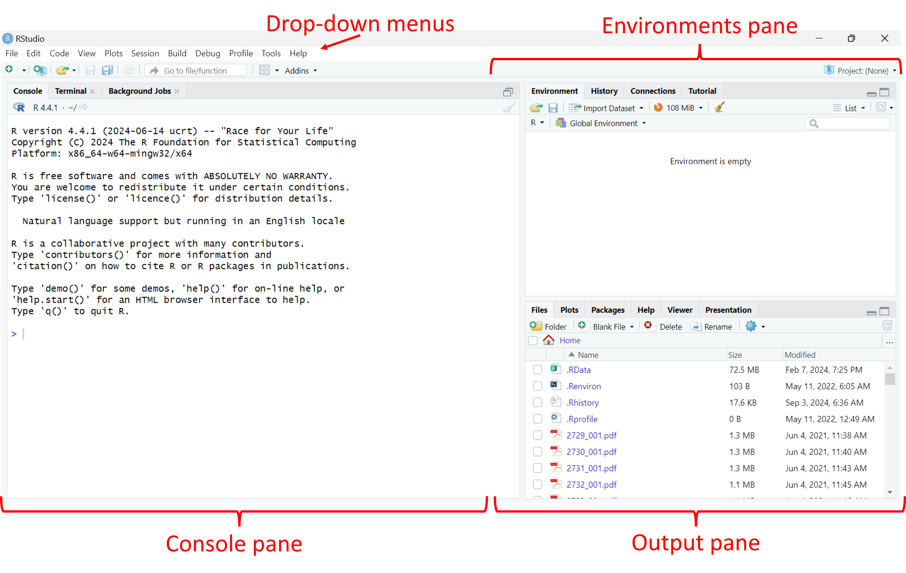
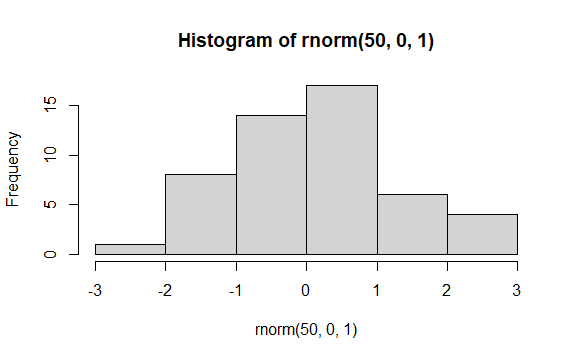

## Navigating RStudio {#NavigatingRStudio}

R can be operated using the command line interface alone, but this course will make use of RStudio for dealing with R code. RStudio is an *integrated development environment (IDE)*, which is used to help operate R, organize R code, and handle visualisation within the same window. The IDE makes the job of interacting with R a lot easier.

To begin, open RStudio. You should see a window that looks like this:

There are four main areas that you should be concerned with at this stage:

- **Dropdown menus** These function in much the same way that menus in other programs do. The *File* menu, for example, is where you can create, open, save, and close files.

- **Environments pane** This pane contains information related to the information currently stored in the system. In particular, there are two tabs which show either the objects stored in the current session (Environment), or the history of commands entered at the command line (History).

- **Console pane** Contains the command line, where commands are passed to R by the user.

- **Output pane** Includes five tabs where outputs (e.g., plots) and other R features can be viewed (discussed below). At the start, this is showing the file system in the current working directory.

An additional pane, the **Source pane**, is typically hidden when first starting RStudio, and will be discussed later. Most activity takes place in the Console pane. Depending on what actions you are undertaking in the Console pane, different things may occur in the Output and Environment panes. To see how this works, try typing the following command into the command line (indicated by an `>`) in the Console pane, and then press enter:

`plot(hist(rnorm(50,0,1)))`{style="color: blue"}

This piece of code uses the `plot` function to plot whatever is inside the outermost brackets. The next bit of code uses the `hist` function to generate a histogram (frequency plot) of some data referenced inside the next set of brackets. Those data are a set of 50 random numbers drawn from a normal distribution, generated using the `rnorm` command, with a mean of 0 and a standard deviation of 1.

The Navigation pane should now jump to the Plots tab, and the result should look something like this:

It's OK if the plot you see looks a little different from the image above: your instance of R will generate different sets of random numbers, but you should see a histogram of values that is normally distributed and is centered near a value of 0.

It's also more than OK if you don't understand how the code works at this stage, the point here is just to demonstrate how the command line works and how different components of RStudio operate in order to visualize data. In addition to Plots, other tabs in the Navigation Pane include

- **File** Provides a file explorer for your computer, with the default file open to the working directory.

- **Packages** Shows which function packages (also sometimes called *libraries*) are installed on this computer and active in this session.

- **Help** Provides access to R help documentation, this opens automatically when calls for help are made at the command line using ? or ?? (we'll learn about this very soon).

- **Viewer** Displays locally generated documents (HTML, PDF, etc).

- **Presentation** Displays outputs from a Quarto presentation (we'll learn about these later).

::: callout-tip
##### Try it yourself!

Have a look through the drop-down menus and try and find the following helpful options:

- **Interrupt R** This will stop the current operation happening in R. This is critical for instances where R is doing something you don't expect and you want it to stop.

- **Install Packages** This opens a window that will allow you to search for packages available through the R package repository (CRAN). Good for when you can't quite remember the name of a package!

- **Global Options** This opens a window that will let you modify the functioning and appearance of RStudio itself.
:::
