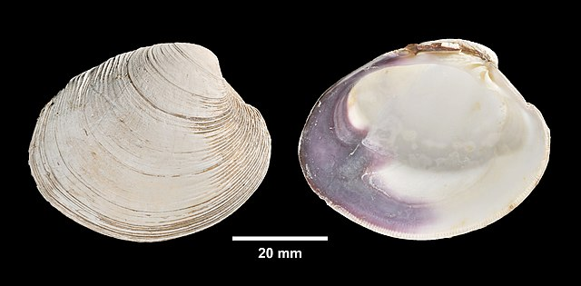
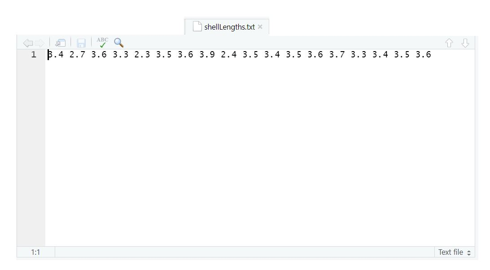

## Looking closer at data objects in R {#DataObjectsInR}

Data are individual pieces of information, while datasets are a way of structuring and organizing data related to a body of work. R stores both data and datasets as different kinds of objects. This section discusses a number of the commonly-encountered object types in R. Try out the examples, but don't worry if it doesn't all stick right away. If you run into a problem with object types, it's helpful just to know that different types of objects exist.

### Atomic vectors

Atomic vectors are the primary way that R stores data. These can be used in expressions and functions, or combined into compound "class" objects (see below). An atomic vector with a single value is sometimes called a **scalar**.

The main rule with vectors is that they are comprised of a single type of data. You can determine what type of data a vector contains using the `typeof` function. There are a few of these, but by far the most common are **numeric**, **logical**, and **character** vectors.

#### Numeric

As shown above, R can interpret numbers in the same way a calculator does. There are two categories of numeric vectors: *integer* and *double*. An integer is stored as a whole number, while a double number can be any number, but includes storage space for decimal values[^03_dataobjects-1]. Some mathematical terms that count as numerical objects are either built into R, such as using `pi` for 𝜋, or require some minor coding, like `exp(1)` for *e*. Below, you can see some examples and how R interprets them.

[^03_dataobjects-1]: The term *double* refers to "[double precision floating point](https://en.wikipedia.org/wiki/Double-precision_floating-point_format "Definition at Wikipedia")."

| Command line | R value    |
|--------------|------------|
| 42           | `42`       |
| 867.5309     | `867.5309` |
| pi           | `3.141593` |
| exp(1)       | `2.718282` |
| sqrt(4)      | `2`        |

: Numerical objects in R

An important thing to keep in mind here is that R treats all numbers as double type by default, and for this course we'll be using numbers stored as double type pretty much exclusively. There are computational reasons why you might want to store values as integers (conserving space, converting to another coding language that requires integers, etc.), but these are rare for most data analysis and visualization activities.

#### Logical

A logical (or Boolean) vector in R has values of either TRUE or FALSE, or shortened to T and F, and these are always expressed in capital letters. Some operations in R will return values as either TRUE or FALSE, while some functions may require input in the form of a logical value. Here are some examples:

`2 == 2`{style="color: blue"}

`[1] TRUE`

`2 == 3`{style="color: blue"}

`[1] FALSE`

`s<-2==3`{style="color: blue"}

`typeof(s)`{style="color: blue"}

`[1] "logical"`

One thing to note here is that, when determining equivalence, a double equals sign (`==`) is used. This is because a single equals sign (`=`) is another way of assigning values to objects[^03_dataobjects-2].

[^03_dataobjects-2]: As we'll see later, the `=` symbol is used when giving arguments inside of functions. While you can use `=` for object assignment, there are several reasons to avoid it and use `<-` or `->` instead. If you're curious, you can read about some of these reasons [here](https://www.r-bloggers.com/2018/07/assignment-in-r-slings-and-arrows/#:~:text=So%E2%80%A6%20should%20you%20or%20shouldn%E2%80%99t%20you).

#### Character

A character vector (also referred to as a string) is text that is meant to be read as text. R cannot interpret the meaning of the text directly, but some functions require character vectors for input. Elements in a character vector are surrounded by quote marks (`"`)[^03_dataobjects-3].

[^03_dataobjects-3]: R will treat double (") and single (') quote marks in the same way. However, the convention is to use double quotes to mark the beginning and end of a string of characters, and to reserve single quotes for instances where the string itself contains quote marks. For example:

    `text<-"Character objects are sometimes referred to as 'string' objects."`

`text<-"text"`{style="color: blue"}

`[1] "text"`

`text<-"text"`{style="color: blue"}

`typeof(text)`{style="color: blue"}

`[1] "character"`

::: callout-tip
##### Try it yourself!

Double, logical, or character: what type of data would the following produce? Make your best guess for each item, and then use the `typeof` function to check your answers:

- 2+2

- (2+2)==4

- T

- typeof(42)

- "false"
:::

#### Using vectors to store data

For work in data analysis and visualization, these different kinds of objects are used to store different kinds of information. For example, if we were conducting a study of recreational shellfish harvesting at Cape Cod beaches, character vectors might be used to record the names of the shellfish species, while numerical vectors could be used for things like species counts.

A *vector* is a type of data object in R that is a ordered collection of values of a given type. The values are in order, so each value has a position. Vectors can be created by entering the values, separated by commas, into a parentheses with a *c* at the front (e.g., `c()`)[^03_dataobjects-4].

[^03_dataobjects-4]: This is actually a function in R, where the "c" is shorthand for "combine".

Here, we'll create two vectors for counts of two different kinds of clams:

.jpeg)



Let's say we've done counts for these two shellfish types at 9 different sites. First, a vector of 9 counts for the soft-shelled clams:

`Mya<-c(45,38,75,62,19,62,60,89,26)`{style="color: blue"}

Then another 9 counts for the quahogs:

`Mercenaria<-c(65,56,58,57,34,89,65,61,91)`{style="color: blue"}

These data are purely fictional, but we can use them to show some key aspects of working with vector data. Individual objects or groups of objects in a vector can be accessed by entering the name of the vector with their position number into a set of square brackets (`[]`).

`Mya[5]`{style="color: blue"}

`[1] 19`

For multiple objects in a vector, the individual positions can be accessed by putting a vector of position numbers inside the square brackets:

`Mercenaria[c(1,3)]`{style="color: blue"}

`[1] 65 58`

Getting a run of values back can be done using the first and last positions separated by a colon (`:`) .

`Mercenaria[1:3]`{style="color: blue"}

`[1] 65 56 58`

And, as was the case for vectors of single values, the type of vector is determined by the kinds of atomic objects it contains:

`typeof(Mercenaria)`{style="color: blue"}

`[1] "double"`

There are lots of different ways you might create a vector. For example, you can create vectors using a function like we did with the `rep` function above. You can also combine multiple existing vectors within a single vector. Here, we will create a vector with 9 instances of each genus name:

`genus<-c(rep("Mya",9),rep("Mercenaria",9))`{style="color: blue"}

Now, we can take a look:

`genus`{style="color: blue"}

`[1] "Mya"        "Mya"        "Mya"        "Mya"        "Mya"`

`[6] "Mya"        "Mya"        "Mya"        "Mya"        "Mercenaria"`

`[11] "Mercenaria" "Mercenaria" "Mercenaria" "Mercenaria" "Mercenaria"`

`[16] "Mercenaria" "Mercenaria" "Mercenaria"`

Remember that each number at left is indicating the position of the value that starts that line. Finally, we can look at what kind of data is stored in this vector:

`typeof(genus)`{style="color: blue"}

`[1] "character"`

This tells us that the **genus** object only contains character-type objects, which makes sense because it's all genus names. Just to be clear, using `typeof` to check the type of data stored in an object is not required to make the code usable. For most activities, you won't need to use this at all, but it's a good way to check that R is doing what you want.

Now let's create a vector of the count data, called **count**, by combining the two vectors of count data stored in the **Mya** and **Mercenaria** objects we created earlier:

`count<-c(Mya,Mercenaria)`{style="color: blue"}

And when we ask R to return this object, we get all of the counts combined:

`count`{style="color: blue"}

`[1] 45 38 75 62 19 62 60 89 26 65 56 58 57 34 89 65 61 91`

It's useful to go through this process to see how vectors are structured. However, it is rare to have a reason to enter data directly into R as we're doing here. Most of the time, we will read data in from a file. This next step will require us to leave RStudio for moment and use a web browser and the computer's file explorer. The following instructions are written in a way that works on most machines, including those in the DataLab:

1.  Using a web browser, go to this week's module on Canvas and download the **shellLengths.txt** file.

2.  This file will now be in your **Downloads** folder; find that folder in your computer's file explorer, and then move it to your default working directory (on a PC that's usually the Documents folder; on a Mac it will usually be your user home directory "\~").

3.  If you now look at the File tab in the Output pane of RStudio, you should see a file called **shellLengths.txt**. If the file isn't there, or you're not sure how to do this, please ask for help.

The **shellLengths.txt** is a text file file that contains the average shell lengths in inches at each site. If you click on this, you should see this come up in a tab in Source pane:\


An important thing to keep in mind here is that even though you can see them here, R needs instructions to read them into memory. Rather than have you type them in manually, you can read these numbers into R as a vector called **meanLength** using the `scan` function:

`meanLength<-scan("shellLengths.txt")`{style="color: blue"}

The `scan` function is used to read unstructured text files; in other words, a series of values separated by whitespaces. A message in the command line should indicate that a number of items were read. We'll learn more tools for reading files later on. For now, if we ask R for the **meanLength** object...

`meanLength`{style="color: blue"}

...it gives us back the following:

`[1] 3.4 2.7 3.6 3.3 2.3 3.5 3.6 3.9 2.4 3.5 3.4 3.5 3.6 3.7 3.3 3.4 3.5 3.6`

Reading and writing from files is an important aspect of working with data and is something we'll cover in more depth next time. But for now just keep in mind that R is capable of putting together data in lots of different ways.

### Class objects

In R, datasets are stored as **class objects**. These can be made up of multiple atomic vectors and, sometimes, multiple class objects. For our purposes, the most commonly used class object will be the dataframe:

#### Dataframes

A dataframe is a table of data, where each column contains data belonging to a single type (e.g., numeric, character, logical). If you've ever used a spreadsheet, the data in a dataframe is organized similarly with columns and rows. Many data operations in R make use of dataframes to organize data. You can create a dataframe from a set of vectors using the `data.frame` function:

`shellfish<-data.frame(genus,count,meanLength)`{style="color: blue"}

Here, we've created a dataframe called **shellfish**, and it is comprised of three vectors. We can look at it by entering its name into the command prompt:

`shellfish`{style="color: blue"}

And the output looks like this:

`genus count meanLength`

`1         Mya    45        3.4`

`2         Mya    38        2.7`

`3         Mya    75        3.6`

`4         Mya    62        3.3`

`5         Mya    19        2.3`

`6         Mya    62        3.5`

`7         Mya    60        3.6`

`8         Mya    89        3.9`

`9         Mya    26        2.4`

`10 Mercenaria    65        3.5`

`11 Mercenaria    56        3.4`

`12 Mercenaria    58        3.5`

`13 Mercenaria    57        3.6`

`14 Mercenaria    34        3.7`

`15 Mercenaria    89        3.3`

`16 Mercenaria    65        3.4`

`17 Mercenaria    61        3.5`

`18 Mercenaria    91        3.6`

Here you can see the dataframe has three columns: genus, count, and meanLength, each corresponding to the vectors we used to create it. You can see the column names at the top of the dataframe, and on the left you can see row numbers. You can access the rows and columns by using square brackets (`[]`), similarly to how you would with a vector. To get a single value, you can

You can also access named columns by using the dollar sign (`$`) immediately following the name of the dataframe. For example, entering the following...

`shellfish$count`{style="color: blue"}

...will return the values from the count column:

`[1] 45 38 75 62 19 62 60 89 26 65 56 58 57 34 89 65 61 91`

#### Other class objects

By far, vectors and dataframes are the most common class objects we will deal with in this course. There are other class objects that are important for working in R and are worth mentioning now, such as:

```{=html}
<details>
  <summary>Lists</summary>
  Lists are like vectors (ordered sequence of values), but they can store different types of objects (e.g., character, numeric) at the same time, and lists can also contain class objects, including vectors, dataframes, and even others lists.
</details>
<details>
  <summary>Matrices</summary>
  A matrix object is like a dataframe in that they are organized into rows and columns, but they can only contain one type of object (e.g., character, numeric) across the entire matrix. These are important for certain mathematical applications and can also be useful for storing and working with spatial data.
</details>
<details>
  <summary>Arrays</summary>
  Arrays operate similarly to matrices, but they can have more than two dimensions. These are useful for higher-order field calculations (imagine, for example, a set of data stored as a matrix recorded at multiple instances over time).
</details>
```

We'll cover these later in the course, but for now just keep in mind that these exist and you might see these referenced in R help documentation from time to time. There are also objects that are unique to functions and packages. For example, the `hist` function returns a **histogram** class object. These are usually composites of some the objects we've discussed already (e.g., a list of vectors). We will talk about a couple of these later on and how to break down their structures into simpler parts.

We'll be using dataframes almost exclusively for the first couple of sessions to store structured datasets. Eventually, we will also look at another table structure called a *tibble*, which is frequently used in the **`tidyverse`** set of packages. Stay tuned!
