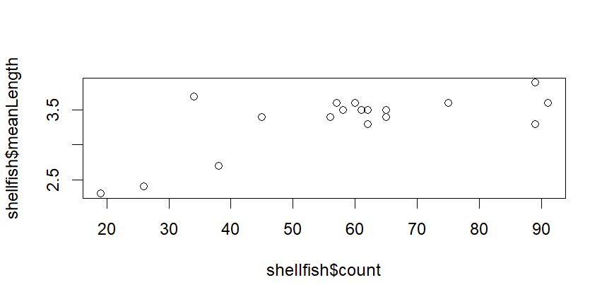
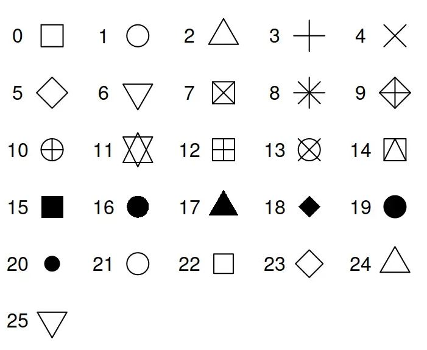
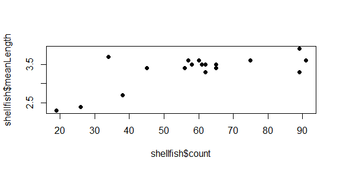
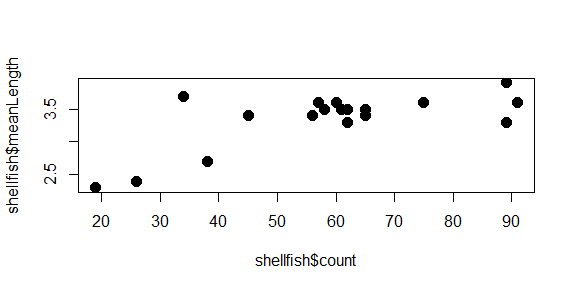
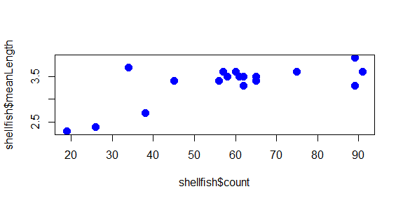
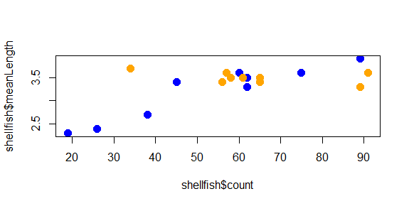
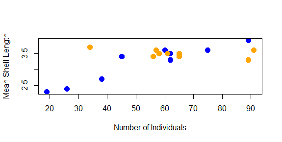
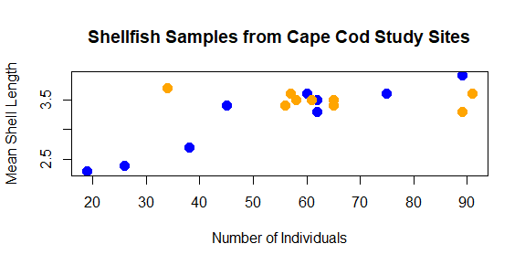
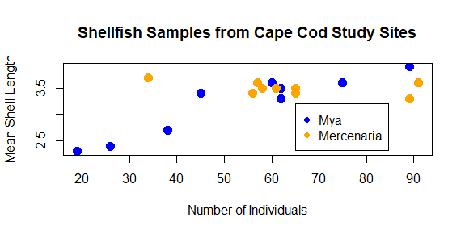
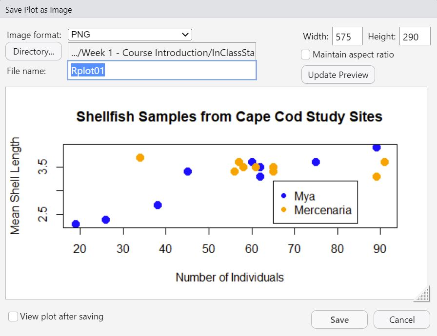

## My first plot

So far, we've learned how to find our way around RStudio, looked at some of the basic concepts of working with data in R, and we've built a first dataset out of vectors. But we've left out one of R's primary attractions: the ease and control it provides over visualizing data. To wrap up this lab, we're going to plot the data we created. We already learned the `plot` command earlier when we were making histograms. This time, rather than plotting the frequency as a single variable, we're going to plot two variables: shellfish counts and average lengths for each site.

`plot(shellfish$count,shellfish$meanLength)`{style="color: blue"}

{fig-align="center"}

This is a scatterplot, which plots points on two axes. The bottom axis, or x axis, shows the count value for each site, while the left axis, or y axis, shows the mean length for each site.

In this case, we're looking at all shellfish together, regardless of the genus to which it belongs. In the following sections, we'll look at some additional arguments we might use to change the appearance of the plot.

### Symbol

Oftentimes, we may want to use different symbols in a plot, either because an open circle isn't particularly effective, or to differentiate between different elements in a plot. To change the symbol being used, the argument to be passed to a plot function here is **pch**, which stands for **p**lotting **ch**aracter. This value is a single whole number which corresponds to a set of plotting symbols. Here are a few examples:

{fig-align="center" width="413"}

There are more symbols available, and there are also ways to add custom symbols, but we'll cover symbols later in the course when we talk more about visualization. For now, let's try using closed circles instead of open ones:

`plot(shellfish$count,shellfish$meanLength,pch=16)`{style="color: blue"}

{fig-align="center"}

### Symbol size

You can modify the size of the symbol using the **cex** argument. This argument will take any positive number, and scales to default value of 1. Numbers smaller than 1 make the symbol smaller, numbers larger than 1 make the symbol larger. Let's say we want our symbols to be 50% larger. We can set cex to 1.5.

`plot(shellfish$count,shellfish$meanLength,pch=16,cex=1.5)`{style="color: blue"}

{fig-align="center"}

Notice how we're just adding arguments to the plot function? All of these arguments are optional, so if they aren't entered, some defaults (eg., size 1, open circles) are used.

::: callout-tip
##### Try it yourself!

One of the really nice features of R is that it keeps track of your history of command line inputs. By pressing the Up key on your keyboard while the cursor is active in the command line, it will let you go back through the history. This can be really helpful if you want to modify a piece of code you wrote recently. Give it a try in the next section!
:::

### Color

We can change the color of the circles used in the scatter plot by adding a **col** argument to the plot function. Let's start by turning all of them blue:

`plot(shellfish$count,shellfish$meanLength,pch=16,cex=1.5,col="blue")`{style="color: blue"}

The plot now has a bit of color:

{fig-align="center"}

You may have noted also that RStudio highlights the text "blue" in blue: there are a number of character strings that R can interpret as colors, as well as hexidecimal numbers and a few other schemes as well. You can find a good overview of these [here](https://www.nceas.ucsb.edu/sites/default/files/2020-04/colorPaletteCheatsheet.pdf "R Color Cheatsheet").

But what if we wanted to use color to give us some additional information? For example, what if we wanted a different color used for each genera we recorded? In this case, we would need to give R a vector that had a color value to correspond with each case. There are a few ways to do this, but since we know that our shellfish data lists the 9 *Mya* counts first and the 9 *Mercenaria* counts second, we can just use `rep` to create a vector of 9 "blue" and 9 "orange":

`shellfishColors<-c(rep("blue",9),rep("orange",9))`{style="color: blue"}

We could add this to our dataframe, but it isn't really data *about* shellfish, only data we use for plotting purposes, so we'll keep it as a separate vector. As long as it is the same length as each column (18), R can interpret it as corresponding to those values. So we just replace "blue" with shellfishColors:

`plot(shellfish$count,shellfish$meanLength,pch=16,cex=1.5,col=shellfishColors)`{style="color: blue"}

And now the plot looks like this:

{fig-align="center"}

The color helps show a pattern in the data. One genus (*Mya*) seems to be smaller in places with fewer counts and larger in places with higher counts, while the other (*Mercenaria*) doesn't seem to have this relationship. This helps illustrate why visualization is important: it helps us to quickly identify patterns in the data that may not be obvious just by looking at a table.

### Axis labels and titles

Right now, the labels on our x and y axes are just the column names we gave to the `plot` function. We can override these using the **xlab** and **ylab** arguments, which take a character string:

`plot(shellfish$count,shellfish$meanLength,pch=16,cex=1.5,col=shellfishColors,xlab="Number of Individuals",ylab="Mean Shell Length")`{style="color: blue"}

{fig-align="center"}

We might also want to add a title to our plot. This is done with the **main** argument:

`plot(shellfish$count,shellfish$meanLength,pch=16,cex=1.5,col=shellfishColors,xlab="Number of Individuals",ylab="Mean Shell Length",main="Shellfish Samples from Cape Cod Study Sites")`{style="color: blue"}

As you can see, some functions can require several arguments that can end up being quite long and difficult to read (not for the machine, but for the person reading it). One of the things we will work on as we go on is how to write code that is easier for us to read as well.

::: callout-tip
## Something to note

You may also be noticing that each version of the `plot` function we've written above is only slightly different from the one before it. The ability to write a piece of code, quickly run it, and then modify it based on the outcome is part of what makes R a powerful tool for working with data. At the same time, it would end up being monstrously repetitive to have to repeatedly type in slightly modified versions of the same code.

As we just learned the Up Arrow key can let us cycle through previously entered code and make changes. Another way we can run, rework, and rerun is by using *scripts*. A script is a document containing lines of code to be run in order.

If you go the **File** dropdown menu and select **New File**, the first option is an *R Script*. This will open a new pane in the top left of the screen into which you can add code. Code written into this space isn't run automatically, but can be run by either highlighting and pressing the **Run** button at the top, or by highlighting and pressing **Ctrl + Enter**. You can save an R script as a .R file by using the **File** dropdown menu and selecting **Save As**. We'll learn more about scripts next time.

The lab assignment for this session will be asking you to modify code from this lab, so you may want to save some of the lines of code you've been writing up to now. You can use the up arrow key to access these, and then copy and paste them into a script.
:::

### Adding a legend

Finally, we should probably add a legend to our plot so we know what color corresponds with what genera. We can't do this with an argument to plot; instead, legend has it's own function.

`legend(65,3.2,legend=c("Mya","Mercenaria"),pch=16,col=c("blue","orange"))`{style="color: blue"}

The first two number arguments (65 and 3.2) tell R where to place the legend, using the values on the x and y axes to correspond with the position of the top left corner of the legend. Next, we tell it what the different colored symbols indicate using a vector with each type in it: *Mya* and *Mercenaria*.

::: callout-tip
##### Try it yourself!

Now that you've seen how we add the different arguments to the plot function, you can vary the values to make it look differently. Try changing the different aspects of the plot to give it a different look. Some things you might do to really challenge your R skills would be:

- Using different symbols for the two genera

- Changing the location of the legend, making sure that it doesn't cover any of your points

- Plotting the size of the symbols based on the mean length of shellfish (hint: you may want create a vector from these values and subtract 1 from each value so they'll fit better)
:::

### Saving your plot

As a last step, we can export the plot so we can use it in a report, a poster, a website: anywhere that someone might use visualizations to tell a story with data. There are ways to do this from the command line that we'll learn later. For now, just click the **Export** button in the Output pane just above the plot, and select . A window like this should come up:

{fig-align="center"}

This will let you choose where you want to save it within your file system (something we'll be discussing more in an upcoming lecture and lab).
