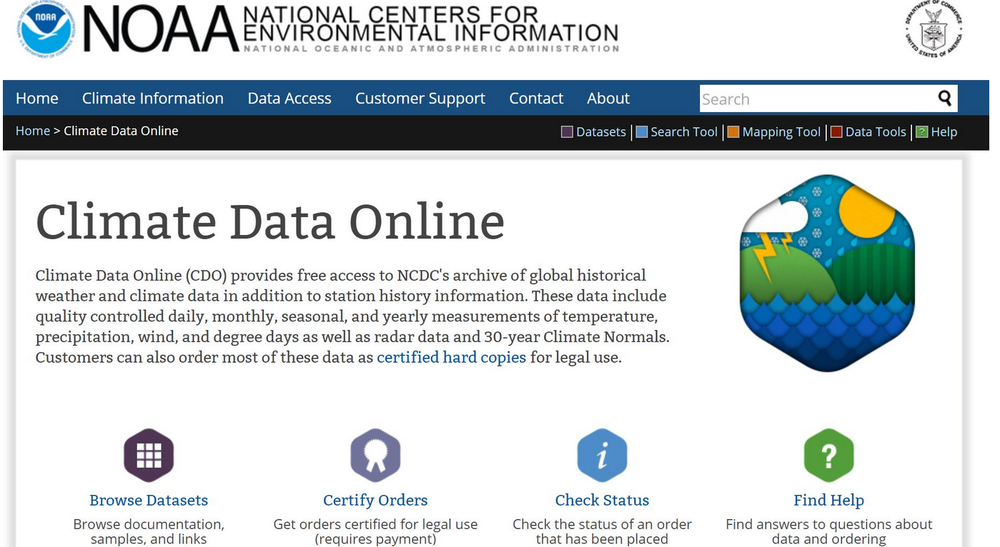
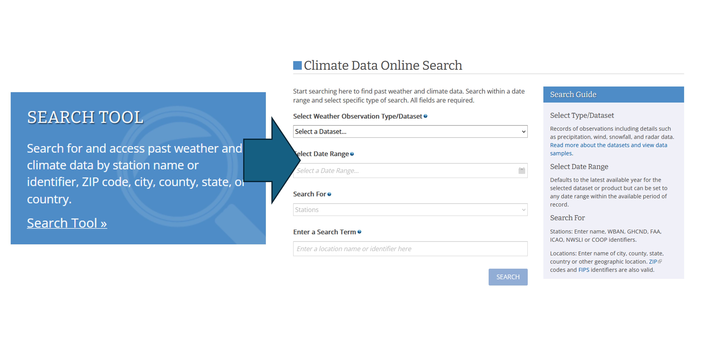
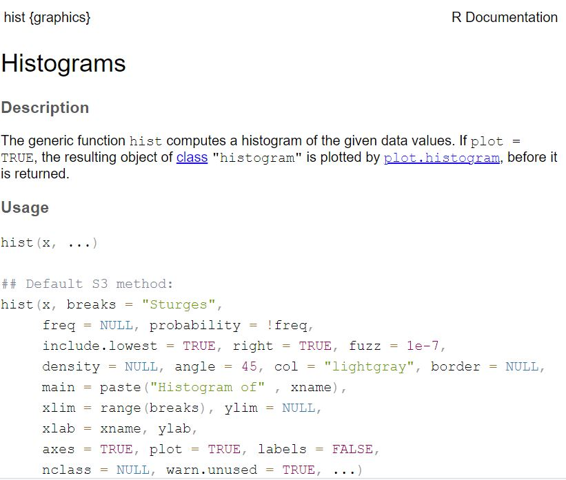

## Dataset of the day

[](https://www.ncei.noaa.gov/cdo-web)

## Dataset of the day

[](https://www.ncei.noaa.gov/cdo-web)

## Dataset of the day

[{fig-align="left" width="100%"}](https://www.ncei.noaa.gov/cdo-web)

## Checking in

::: incremental
- How did it go last week?

- How much do you feel like you remember?

- Ready to keep going?
:::

## The flow of data

Last week we worked on going from raw data to visualizations using base R commands and functions. Today, we'll be focused on the first half of that process: making code easier to save, edit, modify, and integrate with data. Next time, we will look more deeply at visualization using the **`ggplot2`** package.

## Scripts

An R script is a text document that contains lines of R code that can be delivered individually or collectively to the command line.

```{r}
#| echo: TRUE
#| output: FALSE

varA<-c(1:500)
varB<-runif(500,1,100)

data<-data.frame(varA,varB)

plot(data$varA,data$varB,type="l",col="orchid2")
```

## Scripts

An R script is a text document that contains lines of R code that can be delivered individually or collectively to the command line.

```{r}
#| echo: FALSE

varA<-c(1:500)
varB<-runif(500,1,100)

data<-data.frame(varA,varB)

plot(data$varA,data$varB,type="l",col="orchid2")
```

## Scripts

Scripts are text files, so they can be written, saved, and shared easily.

```{r}
#| echo: TRUE
#| output: FALSE

varA<-c(1:500)
varB<-runif(500,1,100)

data<-data.frame(varA,varB)

plot(data$varA,data$varB,type="l",col="orchid2")
```

## Activity

Open RStudio, go to the **File** menu, and create a new script. In that script, add some code:

- Create an object called **myName** and assign your name as a character string

- Create a second object called **introduceMe** and assign the character string "Hi, my name is"

- Use these two objects as arguments in the `paste` function

Highlight all of the code in the script and click **Run**.

## Comments

Comments are text preceded by a comment character. For R, the comment character is `#`. When R receives this at the command line, it knows not to run it.

```{r}
#| echo: TRUE
#| output: FALSE

#here's where we make some data
varA<-c(1:500)
varB<-runif(500,1,100)

#here's where we put it together in a dataframe
data<-data.frame(varA,varB)


#here's where we plot that data
plot(data$varA,data$varB,type="l",col="orchid2")
```

## Comments

Comments are useful for documenting what a piece of code does, both for you and for other users. They can also be helpful for temporarily taking out a piece of code from a script without having to delete it.

```{r}
#| echo: TRUE
#| output: FALSE

#here's where we make some data
varA<-c(1:500)
#varB<-runif(500,1,100)
varB<-rnorm(500,50,20)  #Trying out a normal distribution here

#here's where we put it together in a dataframe
data<-data.frame(varA,varB)


#here's where we plot that data
plot(data$varA,data$varB,type="l",col="orchid2")
```

## File systems

## File systems

The file system is a means of storing and retrieving files on a computer.

## Thinking about file systems

, CC BY-SA 3.0](InClassStatic/Wooden_file_cabinet.JPG){fig-align="center"}

## Talking about file systems

, CC BY-SA 2.0](InClassStatic/yawn.jpg){fig-align="center"}

## File systems

The file system is a means of storing, retrieving, and organizing files on a computer. They are based on a *hierarchical* collection of *directories*.

{fig-align="center"}

## Working directory and subdirectories

::::: columns
::: {.column width="50%"}
The *working directory* is the folder in your file system from which R is working at any given time.\
\
Any folders within the working directory are called *subdirectories*.
:::

::: {.column width="50%"}
](InClassStatic/800px-You_are_here_-_street_sign.jpg)
:::
:::::

## Working directory and subdirectories

](InClassStatic/WMUK_office_-_desks.jpg){fig-align="center"}

## R projects

From RStudio you can create R projects (.Rproj), which will automatically create a working directory in a folder of your choosing.\
\
When you open an R project file later, it will immediately open to your working directory.\

## Losing track of file locations can be frustrating for you...

, CC BY-SA 3.0](InClassStatic/Frustrated.jpg){fig-align="center"}

## ...and can make your code effectively useless to others.

{fig-align="center"}

## Tips for naming files and folders

::: {style="font-size: 80%;"}
- Avoid whitespaces

  - Use camel case (myLabExercise) or snake case (my_lab_exercise)

- Avoid special characters

  - \~ ! \@ \# \$ % \^ & \* ( ) \` ; \< \> ? , \[ \] { } ' " \|

- Try and keep them short

- Avoid the term *final* (e.g., code_exercise_3_finalFinal.R)

  - Instead, use version numbers or dates (e.g., YYYY-MM-DD)

- Above all else... BE CONSISTENT!
:::

## Getting help

## Getting help

My recommended approach to problems you might encounter is

::: incremental
1.  try and change a few things, and if that doesn't work

2.  check the **Help** documentation, and if the answer isn't there

3.  search for a solution on the web, and if that fails

4.  ask someone who can help you
:::

## Accessing help documentation

Help documents describe what functions do, what arguments they take, and what kind of objects they will return.

You can search help using the **Help** tab in the Outputs pane.

## Accessing help documentation

You can also quickly look up a function's help document by typing it into the command line preceded by a question mark (`?`). For example:

`?hist`

## Reading the help documentation



## Reading the help documentation

Help documents include:

- **Description** What does the function do?

- **Usage** How do you call it in R?

- **Arguments** What arguments does it take and what objects should be used?

## Reading the help documentation

Help documents include:

- **Details** Specifics about how different arguments are used within the function

- **Value** The object(s) returned by the function and their structure

- **Examples** Snippets of code showing how the function is used

## Activity

Try looking at the entry for some of the functions we've used so far. Examples include:

- `rep`

- `paste`

- `scan`

- `rnorm`

See if you can use help to find the function for the **Kolmogorov-Smirnov Test**.

## The elephant in the room

{fig-align="center"}

## What about getting help from ChatGPT/Claude/etc?

This sits somewhere between finding a solution on the web and asking someone for help. Under certain conditions, Large Language Models (LLMs) like ChatGPT/Claude/etc can be helpful for coding, data analysis, etc.

## What are the risks?

::: incremental
- LLMs/AI will confidently present incorrect/incomplete solutions as correct.

- LLMs/AI may provide solutions that "work", but use deprecated functions, misnamed packages, or convoluted methods.

- Over multiple, iterated queries, an LLM/AI may produce bloated code or fail to carry over previously requested items.
:::

## How can we use LLMs/AI ethically and effectively in learning?

::: incremental
- Using any tool in this course should facilitate and enhance learning rather than replace it.

- A policy is posted on Canvas to give you guidance for how AI should and should not be used in this course

- If you think there is scope to change this policy, either to enable integration or prevent misuse, please share your thoughts
:::

## Principal guidelines for using LLMs/AI for class work

::: incremental
- **Please refrain from using LLMs during class sessions and to complete in-class lab exercises, visualization critiques, and project proposals.**

- If you are trying to understand a concept outside of class (like the structure of arguments in a function), try asking the LLM to provide an example. *Be sure to also ask it to explain how that example works*.

- If you keep running into an error, you might try pasting your code into the LLM and asking it to identify errors. *Be sure to also ask it how/why this causes an error.*
:::

## As always

If you feel like you are struggling with the material, or having a hard time meeting due dates, or feeling overwhelmed: please let me know! My job is to help facilitate your learning at whatever pace that happens.

## Tuesday night!

::: incremental
- The file system: foundation of the data science enterprise

- Reading and wRiting files

- When the data alone is not enough: Manipulating data and deriving variables
:::
