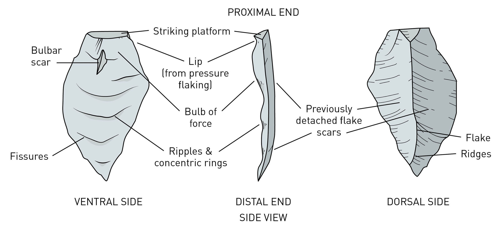
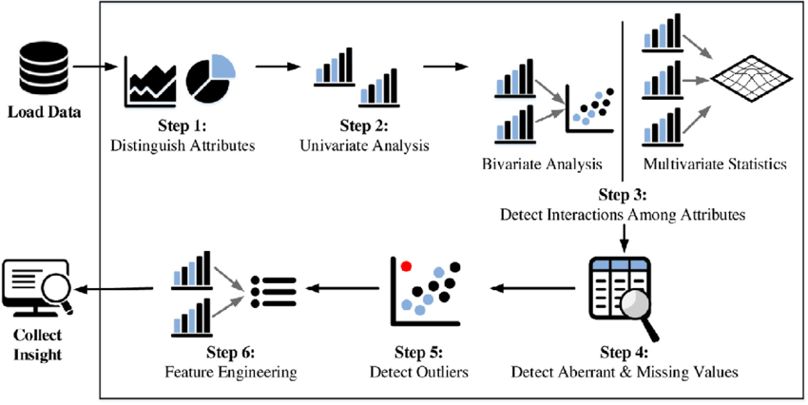

```{r}
#| echo: FALSE
#| output: FALSE
#| message: FALSE
#| warning: FALSE
library(modeldata)
library(tidyverse)
library(hexbin)
abalone<-read_csv("abalone.csv")
bully<-read_csv("nzffdms.csv")
```

## Warm-up activity

Create an R project for today's session, download, and use your ggplot skills to improve on this graph:

```{r}
#| echo: FALSE
#| output: FALSE
#| message: FALSE
#| warning: FALSE
data<-read_csv("nhRealEstate.csv")
ggplot(data,aes(sqft,listPrice,color=type)) +
  geom_point() +
  scale_color_manual(values=c("green","lightgreen","gold","yellow","orange","forestgreen"))
```

\

## Coursekeeping

::: incremental
- Today we will work on techniques related to Exploratory Data Analysis. On Thursday we will get into hypothesis testing and Quarto notebooks.

- On Thursday we will also begin presenting visualization critiques in class. The schedule for these has been posted on Canvas.
:::

## Dataset of the day

Traffic sensors

::::: columns
::: {.column width="50%"}
{fig-align="center"}
:::

::: {.column width="50%"}

:::
:::::

## Dataset of the day

Traffic sensors

](InClassStatic/massDOT.jpg)

## Learning how to look

{fig-align="center"}

## Learning how to look

{fig-align="center"}

## Exploratory Data Analysis

An approach to analysis aimed at revealing data structure, patterns, and features, with the goal of developing and answering questions.

{fig-align="center"}

## Exploratory Data Analysis

- What kind of variation occurs in each variable?

  - What are "typical" values? What is a rare value? Do these values make sense for the variable being observed? Does anything look out of place?

- What kind of co-variation occurs between variables?

  - What do values look like for different categorical groupings of data? Should I expect a relationship between variables and, if so, what kind? If not, why? Is the relationship linear or does it behave in more complex ways?

## Exploratory Data Analysis

Exploratory Data Analysis involves the use of visualization as a means to assessing pattern, structure, and features of the data; to answering questions you pose to the data; and to generating new questions.\
\
Doing so effectively depends in part on knowing what kind of data you have and being able to create and revise appropriate visualizations.

## Getting a clearer view

```{r}
#| echo: TRUE
#| output: TRUE
ggplot(data=Sacramento,aes(x=city,y=price)) +
  geom_boxplot()
```

## Getting a clearer view

```{r}
#| echo: FALSE
#| output: TRUE
ggplot(data=Sacramento,aes(x=city,y=price)) +
  geom_boxplot()
```

## Getting a clearer view

Flip x and y axes

```{r}
#| echo: TRUE 
#| output: FALSE
ggplot(data=Sacramento,aes(x=city,y=price)) +
  geom_boxplot() +
  coord_flip()
```

## Getting a clearer view

Flip x and y axes

```{r}
#| echo: FALSE
#| output: TRUE
ggplot(data=Sacramento,aes(x=city,y=price)) +
  geom_boxplot() +
  coord_flip()
```

## Getting a clearer view

Reorder based on median house prices

```{r}
#| echo: TRUE
#| output: FALSE
ggplot(data=Sacramento,aes(x=fct_reorder(city,price,median),y=price)) + 
  geom_boxplot() +  
  coord_flip()  
```

## Getting a clearer view

Reorder based on median house prices

```{r}
#| echo: FALSE
#| output: TRUE
ggplot(data=Sacramento,aes(x=fct_reorder(city,price,median),y=price)) + 
  geom_boxplot() +
  coord_flip()  
```

## Getting a clearer view

Getting a clearer view

```{r}
 #| echo: TRUE
ggplot(data=Sacramento,aes(x=fct_reorder(city,price,median),y=price)) + 
  geom_boxplot() +
  coord_flip()  +
  labs(x="Price ($)",y="City",title="Home prices in Greater Sacramento")
```

## Seeing data structure

```{r}
#| echo: TRUE 
ggplot(data=abalone,aes(x=diameter*200,y=weight.whole*200)) +
  geom_point()
```

## Seeing data structure

Changing the transparency (`alpha`)

```{r}
#| echo: TRUE
#| output: FALSE
ggplot(data=abalone,aes(x=diameter*200,y=weight.whole*200)) +
  geom_point(alpha=0.1)
```

## Getting a clearer view

Changing the transparency (`alpha`)

```{r}
#| echo: FALSE 
#| output: TRUE 
ggplot(data=abalone,aes(x=diameter*200,y=weight.whole*200)) +
  geom_point(alpha=0.1)
```

## Getting a clearer view

Changing the point size

```{r}
#| echo: TRUE 
#| output: TRUE
ggplot(data=abalone,aes(x=diameter*200,y=weight.whole*200)) +
  geom_point(size=0.1)
```

## Getting a clearer view

Changing the point size

```{r}
#| echo: FALSE
#| output: TRUE
ggplot(data=abalone,aes(x=diameter*200,y=weight.whole*200)) +
  geom_point(size=0.1)
```

## Getting a clearer view

Binning the values (`geom_bin2d`)

```{r}
#| echo: TRUE 
ggplot(data=abalone,aes(x=diameter*200,y=weight.whole*200)) + 
  geom_bin2d()
```

## Getting a clearer view

Binning the values (`geom_hex`)

```{r}
#| echo: TRUE 
ggplot(data=abalone,aes(x=diameter*200,y=weight.whole*200)) +
  geom_hex()
```

## Getting a clearer view

```{r}
#| echo: FALSE
#| output: TRUE

ggplot(data=abalone,aes(x=diameter*200,y=weight.whole*200)) +
  geom_hex() +
  labs(x="Diameter (mm)",y="Whole Weight (g)",title="Abalone weights by diameter")
```

## Getting a clearer view

Data: [Common bully](https://en.wikipedia.org/wiki/Common_bully) (*Gobiomorphus cotidianus)* records from New Zealand Freshwater Fish Database

```{r}
#| echo: TRUE 
#| output: TRUE
ggplot(data=bully,aes(x=altitude,y=maxl)) +
  geom_point()
```

## Getting a clearer view

```{r}
#| echo: FALSE
#| output: TRUE
ggplot(data=bully,aes(x=altitude,y=maxl)) +
  geom_point()
```

## Getting a clearer view

Dropping NA values

```{r}
#| echo: TRUE
#| output: TRUE
ggplot(data=drop_na(bully,maxl),aes(x=altitude,y=maxl)) +
  geom_point()
```

## Getting a clearer view

Zooming in

```{r}
#| echo: TRUE 
#| output: FALSE
ggplot(data=drop_na(bully,maxl),aes(x=altitude,y=maxl)) +
  geom_point() +
  coord_cartesian(xlim=c(0,100))
```

## Getting a clearer view

Zooming in

```{r}
#| echo: FALSE
#| output: TRUE
ggplot(data=drop_na(bully,maxl),aes(x=altitude,y=maxl)) +   
  geom_point() +   
  coord_cartesian(xlim=c(0,100))
```

## Getting a clearer view

Log-10 transformation on x-axis

```{r}
#| echo: TRUE 
#| output: FALSE
ggplot(data=drop_na(bully,maxl),aes(x=altitude,y=maxl)) +
  geom_point() +
  scale_x_continuous(trans='log10')
```

## Getting a clearer view

Log-10 transformation on x-axis

```{r}
#| echo: FALSE 
#| output: TRUE
ggplot(data=drop_na(bully,maxl),aes(x=altitude,y=maxl)) + 
  geom_point() +
  scale_x_continuous(trans='log10')
```

## Getting a clearer view

Add a smooth line

```{r}
#| echo: TRUE 
#| output: FALSE
#| message: FALSE
#| warning: FALSE
ggplot(data=drop_na(bully,maxl),aes(x=altitude,y=maxl)) +
  geom_point() +
  scale_x_continuous(trans='log10')+
  geom_smooth()
```

## Getting a clearer view

Add a smooth line

```{r}
#| echo: FALSE 
#| output: TRUE
#| warning: FALSE
#| message: FALSE
ggplot(data=drop_na(bully,maxl),aes(x=altitude,y=maxl)) +   
  geom_point() +   
  scale_x_continuous(trans='log10')+   geom_smooth()
```

## Seeing the bigger picture

Faceted plots can help us view the same pattern across multiple variables.

```{r}
#| echo: TRUE
#| output: FALSE
ggplot(data=Sacramento,aes(x=sqft,y=price)) +
  geom_point() +
  facet_wrap(vars(type)) +
  theme(axis.text.x=element_text(size=rel(0.75)))
```

## Seeing the bigger picture

Faceted plots can help us view the same pattern across multiple variables.

```{r}
#| echo: FALSE
#| output: TRUE 
ggplot(data=Sacramento,aes(x=sqft,y=price)) + 
  geom_point() +   
  facet_wrap(vars(type)) +
  theme(axis.text.x=element_text(size=rel(0.75)))
```

## Activity: Looking and comparing

- In this exercise, you'll use the `cat_adoption` dataset in the `modeldata` package

- Use the `facet_wrap` function to look at histograms for the following combinations (remember to use the `vars` function to identify your aesthetic mapping):

  - time at shelter by sex

  - time at shelter by intake type

  - time at shelter by another variable of your choice

## Tuesday night

- Introducing Exploratory Data Analaysis

- Univariate, bivariate, and multivariate explorations

- What to do with outliers/errors
